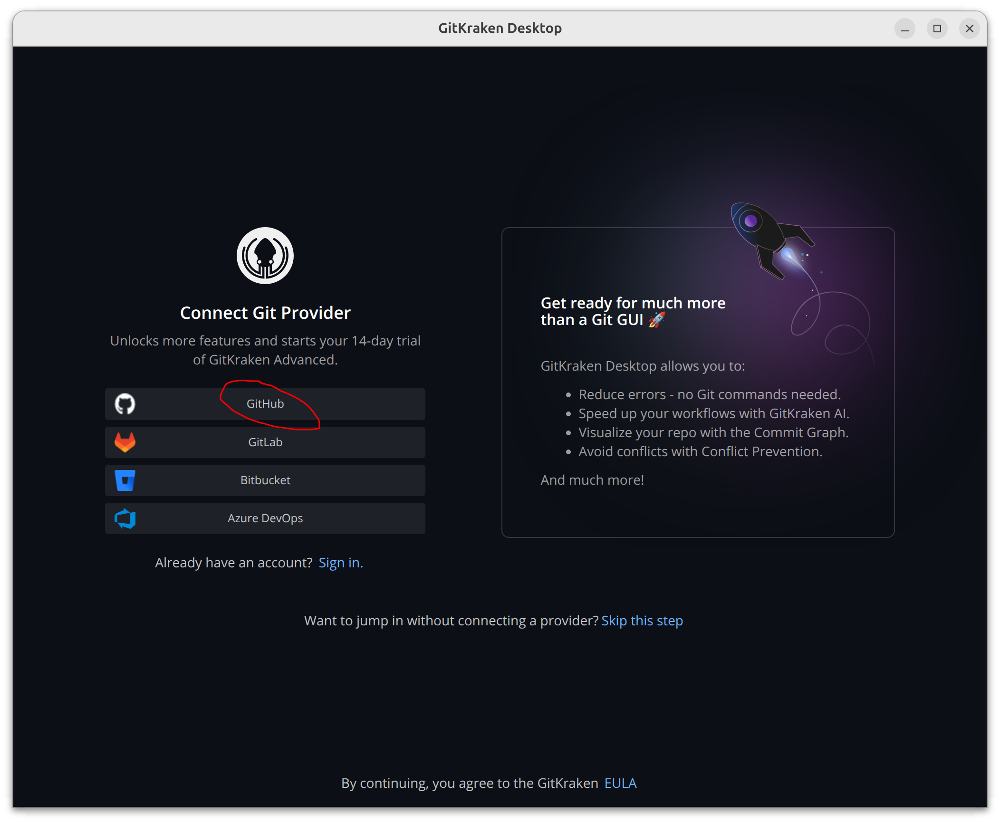
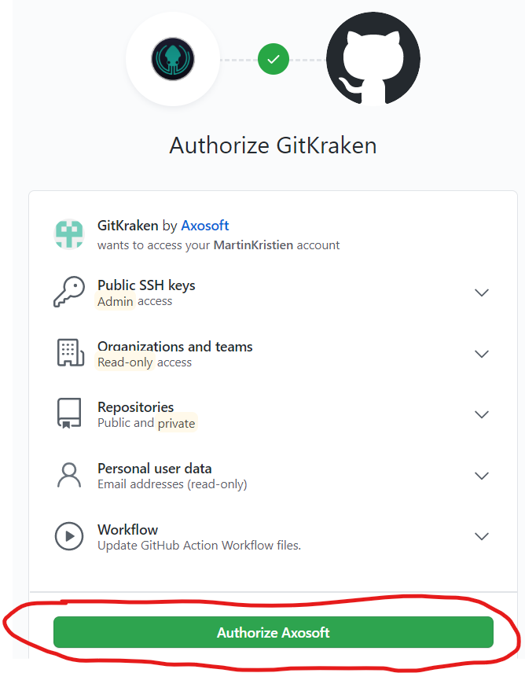
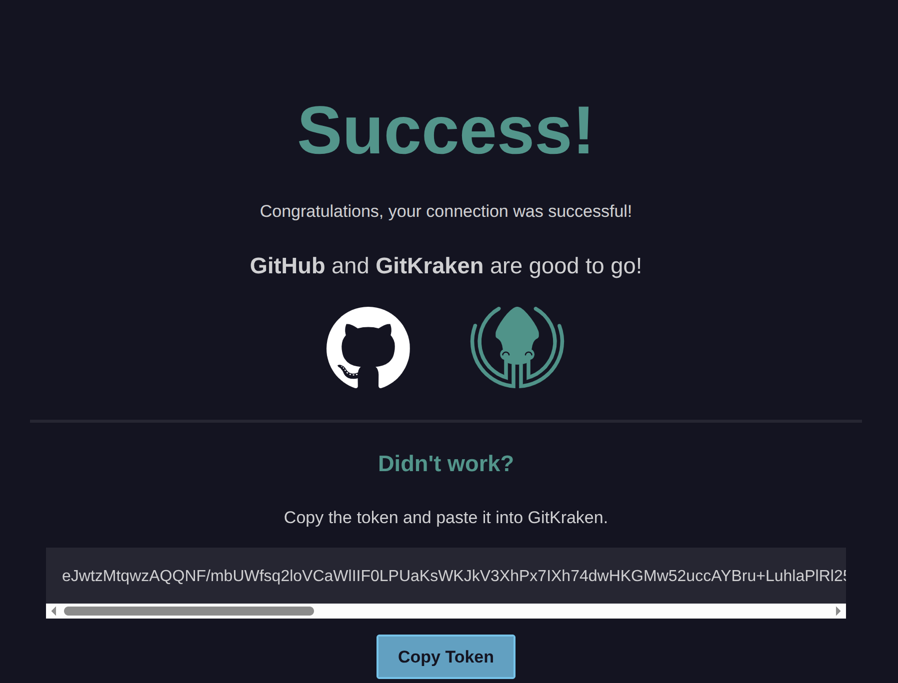
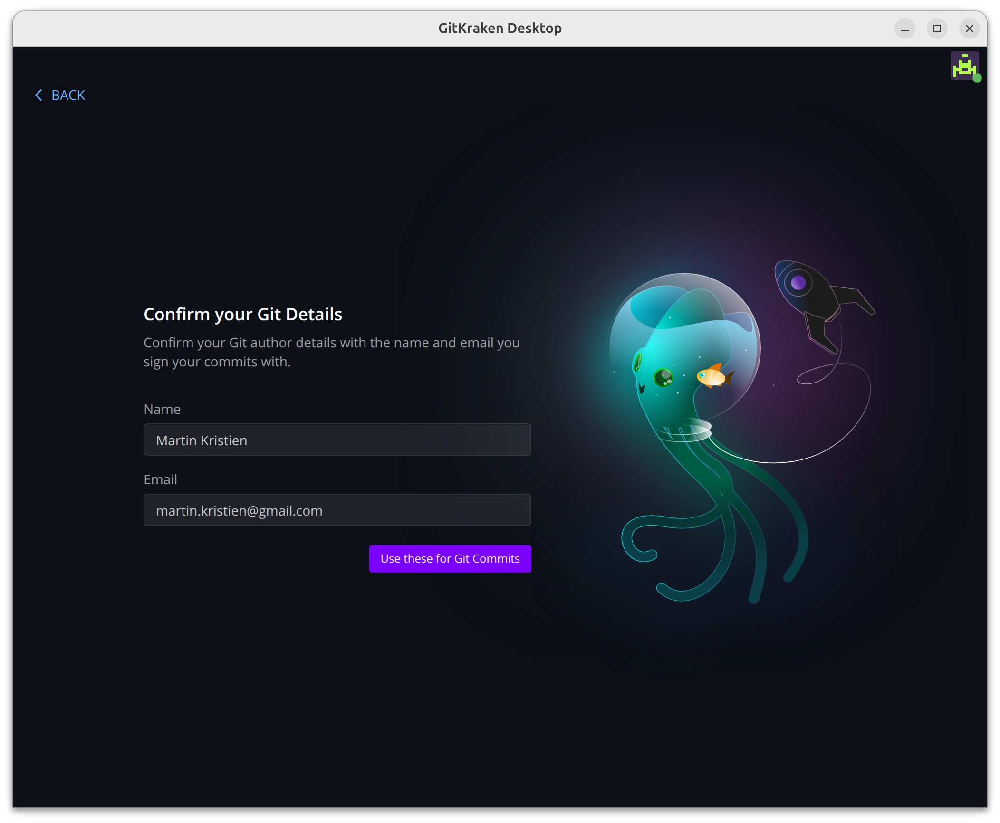
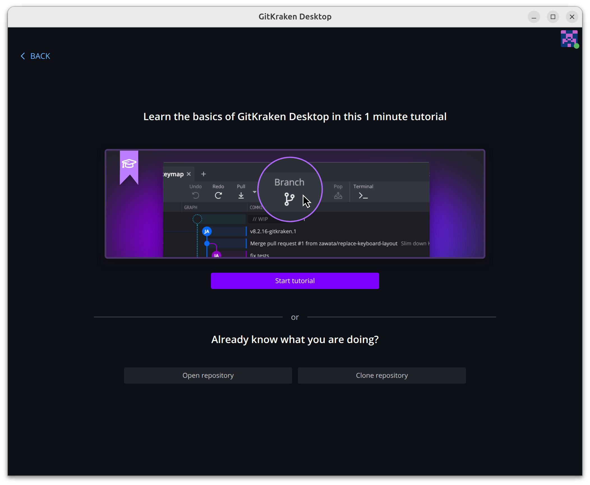

# Čo si pripraviť pred workshopom

Na workshope budeme spoločne pracovať s jedným zdieľaným **úložiskom** (repozitárom) — miestom, kde žije kód a jeho história.

Aby si sa k nemu vedel(a) pripojiť a robiť zmeny, potrebuješ urobiť **tri kroky** v tomto poradí:

1. **Vytvoriť si GitHub účet** — tam úložisko žije online.
2. **Nainštalovať si GitKraken** — aplikácia, cez ktorú budeš s úložiskom pracovať priamo z počítača.
3. **Požiadať o prístup k úložisku** — pošleš mi svoje GitHub meno a ja ťa pozvem.

> 💡 **Kroky 1 a 2 zvládneš úplne sám(a) ešte pred workshopom.** Krok 3 (prístup) je len pozvánka — **nie je to blokujúci bod.** Aj keby ti pozvánka neprišla včas, na workshope to vyriešime za pár sekúnd. Hlavné je mať hotový GitHub účet a nainštalovaný GitKraken.

Stručný prehľad nástrojov:

| Nástroj | Načo slúži |
|---|---|
| **GitHub** | online platforma, kde je úložisko hostované (predstav si niečo ako Google Drive pre kód) |
| **GitKraken** | aplikácia v počítači, cez ktorú s úložiskom pracuješ |

---

## Krok 1 — Vytvor si GitHub účet

1. Choď na [github.com](https://github.com/) a klikni na **Sign up** (vpravo hore).
2. Zadaj email, heslo a používateľské meno.
3. Otvor si email a aktivuj účet cez aktivačný odkaz, ktorý ti od GitHubu príde.

> Toto meno (GitHub username) mi neskôr pošleš v kroku 3.

---

## Krok 2 — Nainštaluj si GitKraken

1. Stiahni a nainštaluj **[GitKraken Desktop](https://www.gitkraken.com/download)**.
   - Podrobný návod na inštaláciu pre tvoj systém: **[help.gitkraken.com → How to install](https://help.gitkraken.com/gitkraken-desktop/how-to-install/)**
     - [Windows (.exe)](https://gitkraken.com/download/windows64) — stačí dvojklik na stiahnutý `.exe`, nainštaluje sa a spustí sám.
     - [macOS (.dmg)](https://gitkraken.com/download/mac?product=gitkraken&source=help_center) — otvor `.dmg` a presuň ikonu GitKraken do priečinka Applications.
     - Linux — `.deb` alebo `.rpm` balík podľa návodu na help stránke.
2. Po spustení **prepoj GitKraken so svojím GitHub účtom** (prihlásiš sa cez GitHub).
3. Nastav si meno a email, ktoré budú tvoriť **podpis pod tvojimi príspevkami** do úložiska.

Úspešná inštalácia a prihlásenie by mali vyzerať podobne ako screenshoty na konci tejto stránky.

---

## Krok 3 — Požiadaj o prístup k úložisku

> ⚠️ Tento krok **nie je blokujúci** — pokojne urob kroky 1 a 2 aj keď si tu ešte nedostal(a) odpoveď. Na workshope prístup doriešime hneď na úvod.

1. Pošli mi svoje **GitHub používateľské meno** na `spekarovic@gmail.com`.
2. Príde ti email s **pozvánkou na spoluprácu** na úložisku.
3. Pozvánku **potvrď** (klikni na odkaz v emaile).

Hotovo — teraz máš prístup k zdieľanému úložisku a si pripravený(á) na workshop. 🎉

---

<!-- screenshoty úspešnej inštalácie GitKraken -->

